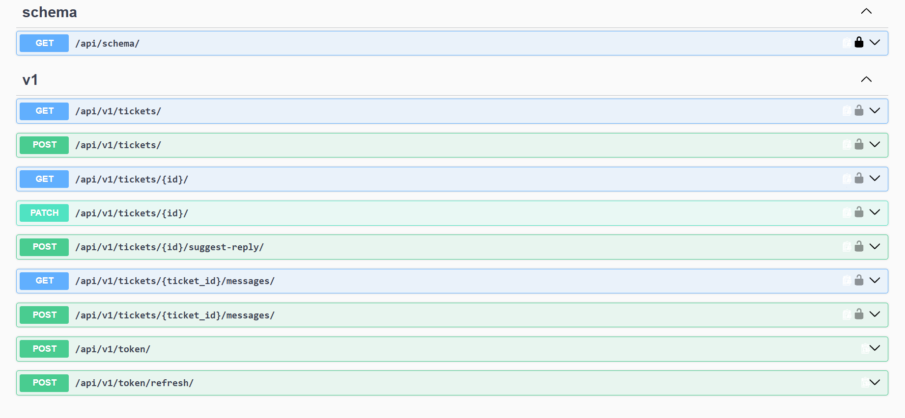
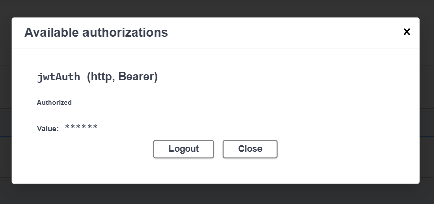
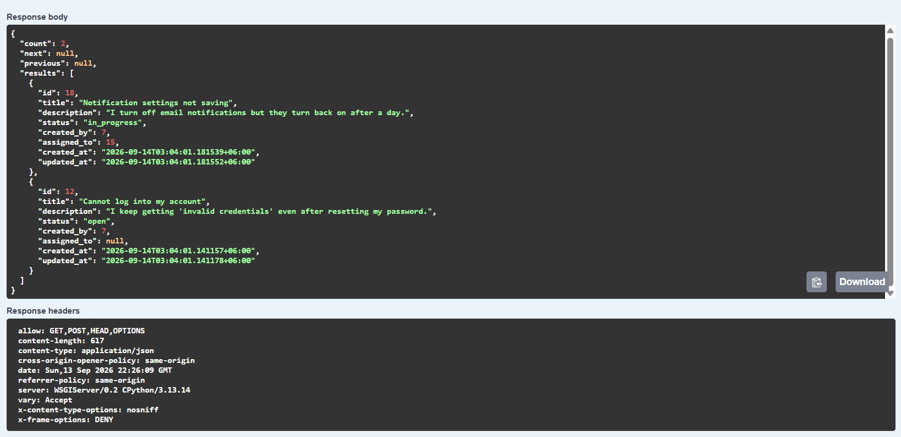
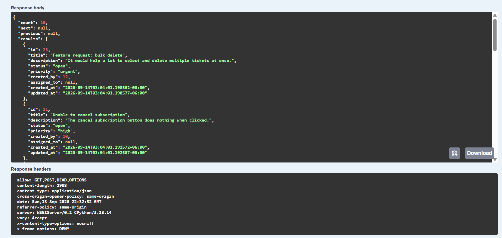

# SupportDesk API

A role-based support ticket management REST API built with Django REST Framework — customers file tickets, agents claim and resolve them, with strict role-aware visibility, permission, and priority rules enforced end-to-end.

> For a deep dive into architecture, business rules, and design decisions, see [ARCHITECTURE.md](./ARCHITECTURE.md).

## Tech stack

- **Python / Django** — web framework
- **Django REST Framework** — API layer
- **PostgreSQL** — database
- **djangorestframework-simplejwt** — JWT authentication
- **drf-spectacular** — OpenAPI schema + Swagger UI
- **django-filter** — filtering/search/ordering
- **google-genai (Gemini)** — AI-suggested reply drafting for agents

## Key features

- Role-based ticket visibility (customers see only their own tickets; agents see unassigned tickets or tickets assigned to themselves)
- Agent self-assignment onto unassigned tickets only — no reassignment, no agent-to-agent handoff
- Status changes restricted to the currently assigned agent
- Priority hidden from customers entirely, and locked for everyone once a ticket is assigned
- Immutable ticket messages (no edit/delete) — permanent conversation history
- Business-severity priority ordering (`low → medium → high → urgent`), not alphabetical
- AI-suggested reply drafting for agents, built from full ticket + conversation context (ephemeral, on-demand, never persisted)
- Unified error response envelope across all error types (400/401/403/404)
- Full interactive API documentation via Swagger UI

## Setup

```bash
git clone https://github.com/hjoy13/supportDesk.git
cd supportdesk
python -m venv .venv
source .venv/Scripts/activate      # Git Bash on Windows
pip install -r requirements.txt
```

Create a `.env` file in the project root with:

```text
DB_NAME=supportdesk_db
DB_USER=supportdesk_user
DB_PASSWORD=<your-password>
DB_HOST=localhost
DB_PORT=5432
GEMINI_API_KEY=<your-gemini-api-key>
```

> Make sure the `supportdesk_db` database and `supportdesk_user` role exist in PostgreSQL before running migrations — this project uses a dedicated database/user, not the PostgreSQL default.

Then:

```bash
python manage.py migrate
python manage.py seed_demo_data      # optional — loads realistic demo data
python manage.py runserver
```

## API documentation

Interactive Swagger UI: **`/api/docs/`**
Raw OpenAPI schema: **`/api/schema/`**

Base API path: **`/api/v1/`**

Example — obtain a JWT and list tickets:

```bash
curl -X POST http://localhost:8000/api/v1/token/ \
  -H "Content-Type: application/json" \
  -d '{"username": "leo_messi", "password": "pass_leo"}'

curl http://localhost:8000/api/v1/tickets/ \
  -H "Authorization: Bearer <access_token>"
```

## API in action

**Full endpoint list (Swagger UI):**



**JWT authorization:**



**Role-based field visibility — the core business rule of this project.** The same `GET /api/v1/tickets/` request returns different results depending on who's asking:

*Customer response — `priority` is completely absent:*



*Agent response — `priority` is visible, and only unassigned/self-assigned tickets are returned:*



## Demo credentials

> ⚠️ These are seeded demo accounts for local evaluation only — not real users, not real data.

| Role | Username | Password |
|---|---|---|
| Customer | `leo_messi` | `pass_leo` |
| Customer | `cristiano_ronaldo` | `pass_cristiano` |
| Agent | `amelia_rossi` | `pass_amelia` |
| Agent | `michael_chen` | `pass_michael` |

Run `python manage.py seed_demo_data` to (re)create the full demo dataset (6 customers, 4 agents, 12 tickets with conversation threads).

## Testing

```bash
python manage.py test apps.tickets
```

34 tests covering ticket visibility, creation, updates, messages, validation, and AI-suggested-reply access control.
